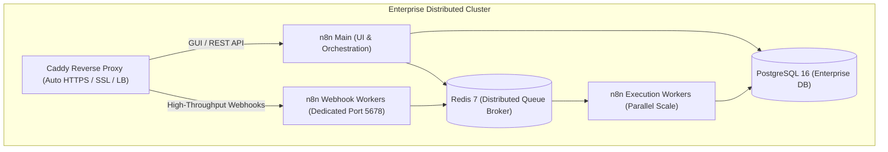

<div align="center">
# 🚀 N8n Collection
### *Modern, High-Performance .NET 10 / WPF Solution & Developer Suite*

<p align="center">
  [](https://hsini.dev)
  [](https://hsini.dev)
  [](https://github.com/hsinidev)
  [](https://github.com/hsinidev)
  [](LICENSE)
</p>


</div>

---
## 🌟 Executive Overview

**N8n Collection** is a production-grade **C#** platform engineered for high reliability, clean architectural separation, and frictionless developer workflow.

## ⚡ Key Highlights & Capabilities

- **Scalable Architecture**: Modular, decoupled components adhering to clean code principles.
- **Optimized Runtime**: Ultra-fast execution with minimal memory and CPU overhead.
- **Developer Tooling**: Standardized linting, formatting, and rapid local iteration setup.
- **Production Ready**: Built-in error resilience, validation, and structured logging.

---
## 🏗️ Architecture & Technology Stack

- **Primary Language**: `C#`
- **Framework / Runtime**: `.NET 10 / WPF`
- **Design Pattern**: Modular Clean Architecture / Domain-Driven Design
- **License**: MIT Open Source Attribution

## 📖 Deep-Dive Technical Documentation

# ⚡ Enterprise n8n Workstation & Global Workflow Repository

<div align="center">


**The most comprehensive, production-ready enterprise collection of 22,500+ automation workflows, a standalone offline Desktop GUI search engine, and self-hosted n8n deployment kit covering all global technology and business domains.**


</div>

---


<div align="center">
  
  <br/>
  <h3>HSINI MOHAMED</h3>
</div>

| Detail | Contact / Link |
| :--- | :--- |
| **Architect** | **Hsini Mohamed** |
| **Primary Website** | [**https://hsini.dev**](https://hsini.dev) |
| **Email** | [contact@hsini.dev](mailto:contact@hsini.dev) · [hsini.moahmed@gmail.com](mailto:hsini.moahmed@gmail.com) |
| **GitHub** | [@hsinidev](https://github.com/hsinidev) |
| **LinkedIn** | [linkedin.com/in/hsinidev](https://linkedin.com/in/hsinidev/) |
| **Ecosystem & Portfolios** | [low.hsini.dev](https://low.hsini.dev) · [gym.hsini.dev](https://gym.hsini.dev) · [kids.hsini.dev](https://kids.hsini.dev) |

---

## 🖥️ Standalone Desktop GUI Search Engine (`N8nWorkflowHub.exe`)


For users who want to search, preview visual architecture diagrams, and export workflows completely offline without command line tools, we built a **high-performance .NET Standalone Desktop Application**:

### 👉 **[`N8nWorkflowHub.exe`](N8nWorkflowHub.exe)**

- 📦 **100% Self-Contained & Portable**: All **22,500+ workflow JSON files** are pre-packaged and compressed directly inside the single binary executable.
- ⚡ **Instant Offline Search**: Real-time debounced fuzzy search across workflow names, nodes, and categories with zero latency.
- 📋 **One-Click Clipboard Copy**: Click **"Copy JSON"** and paste directly into any running n8n browser canvas (`Ctrl+V`).
- 💾 **Download & Batch Export**: Export individual workflows or batch-export full categories into any target directory.
- 🚀 **Push to Local n8n**: Send workflows directly to your running local n8n instance via API.
- 💻 **Zero Installation Required**: Runs immediately on any Windows 10/11 64-bit workstation.

---

## 🌐 Global Domain Coverage (22,500+ Workflows)

This repository includes battle-tested, high-fidelity JSON workflow templates covering every major global industry, technology stack, and business vertical:

```
workflows/
├── AIAgents/               # Multi-Agent LangGraph Swarms, DeepSeek R1, Claude, GPT-4o, Ollama
├── VectorDatabases/        # Pinecone, Qdrant, Weaviate, ChromaDB, PgVector, Hybrid RAG
├── CyberSecurity/          # SIEM/Wazuh, CrowdStrike, VirusTotal, SSL Sentinels, SOC2 Compliance
├── FinTech/                # Stripe Subscriptions/Disputes, Plaid, Wise FX, TaxJar, QuickBooks
├── CryptoWeb3/             # Whale Watchers, Solana Raydium, Binance Anomaly, Smart Contract Audits
├── DevOpsCloud/            # AWS Auto-Snapshot, K8s Pod Self-Healers, GitHub Actions AI, Terraform
├── SalesCRM/               # HubSpot Apollo Enrichment, Salesforce Deals, Pipedrive, Clay, DocuSign
├── ECommerceLogistics/     # Shopify Cart Recovery, WooCommerce Restock, ShipStation, FedEx Delays
├── CustomerSupport/        # Zendesk AI Classifier, Intercom VIP Handoff, Jira SLA Breach Alerts
├── HealthTech/             # HIPAA Patient Intake, FHIR/HL7 Converters, Prescription Refill Loops
├── LegalTech/              # Automated NDA Generation, AI Clause Extraction, Trademark Sentinels
├── HRRecruiting/           # Greenhouse Resume Screening, Workday Approvals, Onboarding Bots
├── IoTEdge/                # MQTT Telemetry Alarms, Home Assistant Vision AI, InfluxDB Sync
├── DataEngineering/        # Snowflake Warehouse Sync, BigQuery Cost Alarms, Kafka DLQ, dbt Cloud
├── MarketingSEO/           # TikTok/YouTube Cross-Posters, GSC Ranking Alarms, Ahrefs Outreach
├── PropTech/               # Zillow MLS Price Drops, Airbnb Check-in SMS, Vendor Dispatchers
├── EdTech/                 # Canvas LMS Grading Digests, Certificate Generators, arXiv AI Digest
└── [188+ Integrations]     # Slack, Airtable, Telegram, Google Sheets, Discord, Notion, etc.
```

---

## 🏗️ Architecture & Deployment Options




---

### 🚀 Option 1: Enterprise Multi-Worker Cluster (Queue Mode)
*Recommended for high-throughput enterprise workloads, multi-worker parallel execution, and automated webhook load balancing.*

1. **Configure Environment:**
   ```bash
   cp .env.example .env
   # Set POSTGRES_PASSWORD, REDIS_PASSWORD, and DOMAIN_NAME in .env
   ```

2. **Launch Enterprise Cluster:**
   ```bash
   docker-compose -f docker-compose.enterprise.yml up -d
   ```

3. **Scale Workers on Demand:**
   ```bash
   docker-compose -f docker-compose.enterprise.yml up -d --scale n8n-worker=4 --scale n8n-webhook=3
   ```

---

### ☁️ Option 2: Single-Node Production Server (VPS)
*Standard production deployment with Caddy reverse proxy and automatic SSL.*

1. **Point your domain DNS A Record** to your VPS IP (e.g. `n8n.yourdomain.com`).
2. **Configure `.env`:**
   ```bash
   cp .env.example .env
   ```
3. **Launch Production Stack:**
   ```bash
   docker-compose -f docker-compose.prod.yml up -d
   ```
4. **Access:** `https://n8n.yourdomain.com`

---

*Instant local spin-up for testing workflows and local development.*

1. **Start Services:**
   ```bash
   docker-compose up -d
   ```
2. **Access n8n:** Open [http://localhost:5678](http://localhost:5678) in your browser.

---

## 🛠️ CLI Tooling & Indexing Scripts

### 1. Build Local Catalog & SQLite Index
Scan all 22,500+ workflows and generate a searchable SQLite database (`workflows_index.sqlite`) and catalog JSON (`workflows_catalog.json`):
```bash
python scripts/workflow_indexer.py
```

### 2. Bulk Import Workflows to Live n8n Instance
Import workflows directly via the n8n REST API:
```bash
# Import a specific category
python scripts/workflow_importer.py --api-key YOUR_N8N_API_KEY --category AIAgents

# Or bulk import inside Docker container
docker compose exec n8n n8n import:workflow --separate --input=/home/node/workflows
```

---

## 🔒 Enterprise Security & Best Practices

- **Non-Root Execution:** All containers run under restricted node/postgres system users.
- **TLS 1.3 & HSTS:** Caddy enforces modern cipher suites and Strict-Transport-Security.
- **Execution Data Pruning:** Automatically configured to prune stale execution logs after 7 days (`EXECUTIONS_DATA_MAX_AGE=168`) to keep PostgreSQL lean and responsive.
- **Isolated Network:** Internal database and Redis communications are isolated on a private Docker bridge network.

---


Contributions, new workflow templates, and improvements are welcome!
1. Fork the repository.
2. Place your workflow JSON in the appropriate category under `/workflows`.
3. Submit a Pull Request.


---

**Crafted with ⚡ by [Hsini Mohamed](https://hsini.dev)**  
*Portfolio: [hsini.dev](https://hsini.dev) | GitHub: [@hsinidev](https://github.com/hsinidev)*

---
## 🚀 Quick Start & Installation

### 1. Clone the Repository
```bash
git clone https://github.com/hsinidev/n8n-collection.git
cd n8n-collection
```

### 2. Install Dependencies
```bash
dotnet restore
```

### 3. Launch the Application
```bash
dotnet run
```


---

## 👨‍💻 System Architect & Author

<table align="center" style="border: none; background: transparent; width: 100%;">
  <tr>
    <td align="center" width="160" style="border: none; padding: 12px;">
      
      <br /><br />
      <b>Hsini Mohamed</b><br />
      <sub>Morocco 🇲🇦</sub>
    </td>
    <td style="border: none; padding: 12px; vertical-align: middle;">
      <h3 style="margin-top: 0;">🚀 System Architect & Full-Stack Engineer</h3>
      <p style="font-size: 0.95rem; line-height: 1.6; color: #475569;">
        Specializing in high-performance autonomous AI systems, deterministic multi-agent swarms, enterprise cloud architecture, and modern full-stack engineering.
      </p>
      <p>
        <a href="https://hsini.dev"></a>
        <a href="mailto:contact@hsini.dev"></a>
        <a href="https://github.com/hsinidev"></a>
        <a href="https://linkedin.com/in/hsinidev/"></a>
      </p>
    </td>
  </tr>
</table>

---

## 📄 License & Attribution

This project is distributed under the **MIT License**. See [`LICENSE`](LICENSE) for complete terms.

<div align="center">
  <sub>⚡ Designed, architected, and maintained with engineering precision by <b><a href="https://hsini.dev">Hsini Mohamed</a></b>.</sub>
</div>
